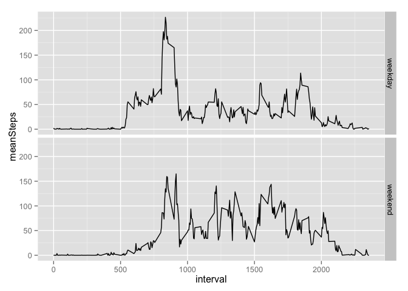

# Reproducible Research: Peer Assessment 1
Ha Nguyen  


## Loading and preprocessing the data

```r
download.file("https://d396qusza40orc.cloudfront.net/repdata%2Fdata%2Factivity.zip", "activity.zip", method = "curl")
unzip("activity.zip",files = "activity.csv")
activity <- read.csv("activity.csv", stringsAsFactors = F)
```

## What is mean total number of steps taken per day?
### Total number of steps taken each day 

```r
library(dplyr)
```

```
## 
## Attaching package: 'dplyr'
## 
## The following object is masked from 'package:stats':
## 
##     filter
## 
## The following objects are masked from 'package:base':
## 
##     intersect, setdiff, setequal, union
```

```r
activity_per_day <- activity %>% group_by(date) %>% summarise(totalSteps = sum(steps, na.rm = T))
activity_per_day
```

```
## Source: local data frame [61 x 2]
## 
##          date totalSteps
## 1  2012-10-01          0
## 2  2012-10-02        126
## 3  2012-10-03      11352
## 4  2012-10-04      12116
## 5  2012-10-05      13294
## 6  2012-10-06      15420
## 7  2012-10-07      11015
## 8  2012-10-08          0
## 9  2012-10-09      12811
## 10 2012-10-10       9900
## ..        ...        ...
```

### Histogram 

```r
hist(activity_per_day$totalStep)
```

 

### Mean and median of the total steps taken per day 

```r
summary(activity_per_day$totalStep)
```

```
##    Min. 1st Qu.  Median    Mean 3rd Qu.    Max. 
##       0    6778   10400    9354   12810   21190
```

## What is the average daily activity pattern?
### Get the mean steps per time interval

```r
activity_per_interval <- activity %>% group_by(interval) %>% summarise(meanSteps = sum(steps, na.rm=T)/length(date))
activity_per_interval
```

```
## Source: local data frame [288 x 2]
## 
##    interval  meanSteps
## 1         0 1.49180328
## 2         5 0.29508197
## 3        10 0.11475410
## 4        15 0.13114754
## 5        20 0.06557377
## 6        25 1.81967213
## 7        30 0.45901639
## 8        35 0.75409836
## 9        40 0.00000000
## 10       45 1.27868852
## ..      ...        ...
```

### Time series plot of the 5-minute interval 

```r
with(activity_per_interval, plot(interval, meanSteps, type = "l", main = "Average daily activity")) 
```

 

* interval from 8-9 am contains the maximum number of steps 

## Imputing missing values
### Number of missing values in the data set 

```r
sum(is.na(activity$steps ))
```

```
## [1] 2304
```

### Filling all missing values with the mean for that 5-min interval 

```r
# Create copy of data set and filling missing values in the data set 
activityComp <- activity
# Record interval having missing values 
intervalMissingV <- activityComp$interval[is.na(activityComp$steps)]
# Replace them with mean of 5 min interval corresponded 
activityComp$steps[is.na(activity$steps)]<- activity_per_interval$meanSteps[match(intervalMissingV, activity_per_interval$interval)]
head(activityComp)
```

```
##        steps       date interval
## 1 1.49180328 2012-10-01        0
## 2 0.29508197 2012-10-01        5
## 3 0.11475410 2012-10-01       10
## 4 0.13114754 2012-10-01       15
## 5 0.06557377 2012-10-01       20
## 6 1.81967213 2012-10-01       25
```

### Histogram of steps taken per day 

```r
activityComp_per_day <- activityComp %>% group_by(date) %>% summarise(totalSteps = sum(steps, na.rm = T))
hist(activityComp_per_day$totalSteps)
```

 

### Mean and median of total number of steps taken per day with missing values replaced 

```r
summary(activityComp_per_day$totalStep)
```

```
##    Min. 1st Qu.  Median    Mean 3rd Qu.    Max. 
##      41    9354   10400   10580   12810   21190
```

### Compared with Old mean and median of total number of steps taken per day with missing values 

```r
summary(activity_per_day$totalStep)
```

```
##    Min. 1st Qu.  Median    Mean 3rd Qu.    Max. 
##       0    6778   10400    9354   12810   21190
```

- Affect of Imputing missing data on the estimates of the total daily number of steps: 

        +  Changing Mean values
        +  Keeping Median value the same.  

## Are there differences in activity patterns between weekdays and weekends?
### Convert date column into date type 

```r
activityComp$date <- strptime(activityComp$date, format = "%F")
```

### Find weekday for each date column 

```r
activityComp$weekday <- weekdays(activityComp$date)
```

### Create factor variable to identify weekday / weekend 

```r
weekday_list <- c("Monday", "Tuesday","Wednesday", "Thursday", "Friday")
activityComp$isWeekday <- as.factor(ifelse(activityComp$weekday %in% weekday_list, "weekday", "weekend"))
```

### Time Series Plot of the 5-minute interval and the average number of steps taken, averaged across all weekday days or weekend days

```r
library(ggplot2)
activityComp$date <- as.character(activityComp$date)
activityComp_per_weekday <- activityComp %>% group_by(isWeekday, interval) %>% summarise(meanSteps = sum(steps, na.rm=T)/length(isWeekday))
activityComp_per_weekday
```

```
## Source: local data frame [576 x 3]
## Groups: isWeekday
## 
##    isWeekday interval  meanSteps
## 1    weekday        0 2.22112933
## 2    weekday        5 0.43934426
## 3    weekday       10 0.17085610
## 4    weekday       15 0.19526412
## 5    weekday       20 0.09763206
## 6    weekday       25 1.55373406
## 7    weekday       30 0.68342441
## 8    weekday       35 1.12276867
## 9    weekday       40 0.00000000
## 10   weekday       45 1.77049180
## ..       ...      ...        ...
```

```r
qplot(data = activityComp_per_weekday, x = interval, y = meanSteps, 
      geom = "path", facets =isWeekday~.) 
```

 

- It seems there were more steps/activities in weekday than in weekend. 
